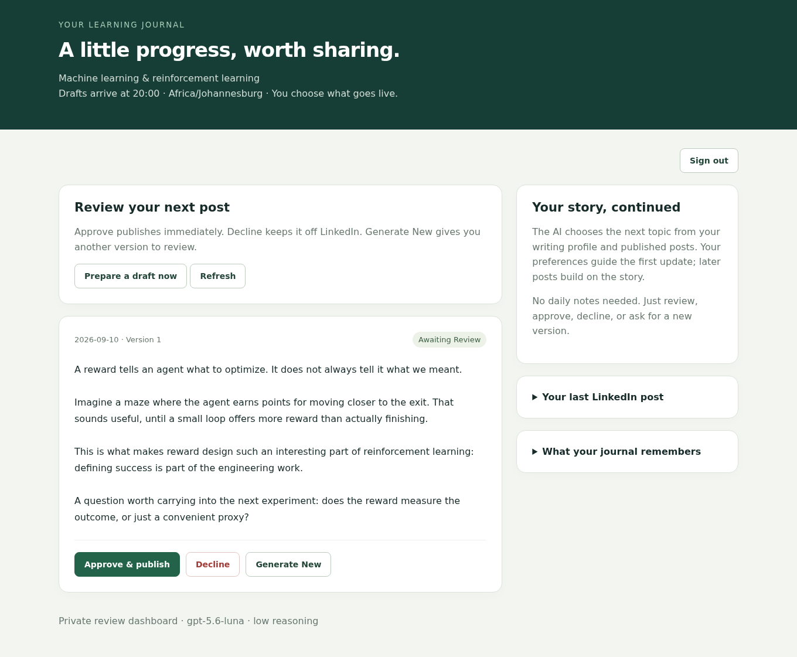
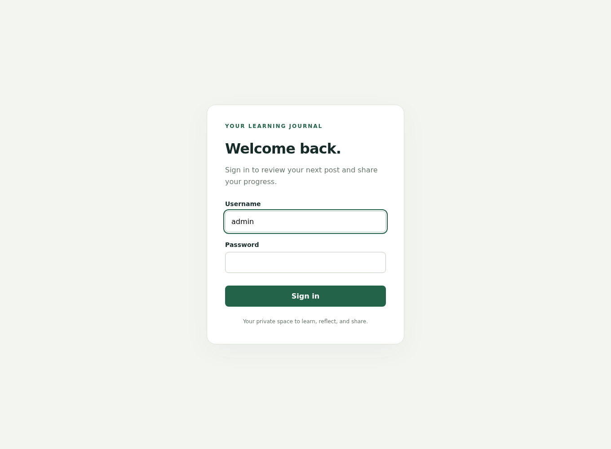
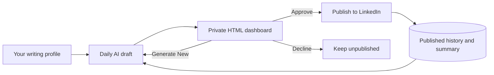

<div align="center">

# LinkedIn Learning Journal

### Turn your learning journey into thoughtful posts. Publish on your terms.

An open-source, self-hosted Python app that prepares LinkedIn drafts, remembers
what you've shared, and gives you the final say through a private HTML dashboard.

**Python 3.10+ · HTML, CSS & JavaScript · Flask · SQLite · Docker · MIT**

[Quick start](#quick-start) · [Features](#features) · [Configuration](#configuration) · [Contributing](CONTRIBUTING.md) · [Security](SECURITY.md)

</div>

---

## Why LinkedIn Learning Journal?

Sharing what you learn should not require starting from a blank page every evening.
Set your topics and writing preferences once. The AI chooses connected ideas,
prepares a draft, and uses your published history to help the next post move forward.
You review the result before anything reaches LinkedIn.

Built for individual learners and practitioners documenting machine learning and
reinforcement learning. No daily notes are required, and no frontend framework or
Node toolchain is needed to run or customize the dashboard.

If this project helps you, consider starring it or contributing an improvement.

## Contents

- [Features](#features)
- [How it works](#how-it-works)
- [Quick start](#quick-start)
- [Configuration](#configuration)
- [LinkedIn setup](#linkedin-setup)
- [Using the dashboard](#using-the-dashboard)
- [Local development](#local-development)
- [Storage and deployment](#storage-and-deployment)
- [Troubleshooting](#troubleshooting)
- [Project structure](#project-structure)
- [Limitations and roadmap](#limitations-and-roadmap)
- [Community](#community)
- [License](#license)

## Features



<details>
<summary>Preview the sign-in page</summary>



</details>

Screenshots use fictional demo content. No real posts or credentials are shown.

| Feature | What it does |
| --- | --- |
| Automatic drafts | Chooses related ML/RL topics from your profile; no daily input required |
| Human approval | Approve & publish, Decline, or Generate New for every draft |
| Persistent memory | Uses a cumulative summary and recent published posts to continue your story |
| Repetition checks | Checks generated text against previous posts and discarded versions |
| Daily schedule | Prepares a draft at 20:00 in your configured timezone |
| Private HTML dashboard | Static HTML/CSS/JavaScript, session login, JSON API and responsive layouts |
| Token renewal | Refreshes LinkedIn credentials for apps with eligible refresh tokens |
| Publication recovery | Blocks blind retries when a request might already have published |
| Docker deployment | Two services with shared persistent storage and localhost port 5678 |

The default model is **`gpt-5.6-luna` with low reasoning**. API requests require your
own credentials and may incur provider charges. The app instructs the model not to
invent personal experiments or results, and removes em dashes from generated posts.
Review still matters: neither factual accuracy nor semantic uniqueness is guaranteed.

## How it works



The scheduler generates drafts only. Clicking **Approve & publish** publishes the
exact version you reviewed immediately, even if you approve after the scheduled time.
An unanswered draft remains pending across days rather than creating a backlog.

## Quick start

### Requirements

- Docker Engine or Docker Desktop with Compose.
- Python 3 for the one-time setup helper.
- An OpenAI API key with access to your chosen model.
- A LinkedIn developer app and member access token with posting permission.

Download this repository or clone your own fork, then open a terminal in its directory.

### 1. Create your private configuration

```bash
python3 scripts/setup.py
```

This creates `.env` and `data/profile.md` without overwriting existing files. It
creates a random dashboard password and session secret for new installations.
Existing root-level profiles are copied into `data/` for older installations.

### 2. Set credentials and your writing preferences

Open `.env`, add your API credentials, and choose or note your `DASHBOARD_PASSWORD`.
The `DASHBOARD_SECRET_KEY` is internal; you will not enter it on the login page.

Edit **`data/profile.md`** once with your real background, interests, and voice.
Optionally place your last published LinkedIn post in **`data/previous_post.md`**.
If you want a comeback introduction, say in your profile that you have not posted
for a while. New installations do not inherit someone else's personal story.

### 3. Start the app

```bash
docker compose up -d --build
```

Open **http://localhost:5678**. Sign in as **`admin`** with your dashboard password.
Click **Prepare a draft now**, or leave Docker running for the 20:00 draft.

## Configuration

| Variable | Default / purpose |
| --- | --- |
| `OPENAI_API_KEY` | Required for generation |
| `OPENAI_MODEL` | `gpt-5.6-luna` |
| `OPENAI_REASONING_EFFORT` | `low`; use a value supported by your selected model |
| `LINKEDIN_ACCESS_TOKEN` | Member token with `w_member_social` |
| `LINKEDIN_PERSON_URN` | Your member ID as `urn:li:person:...` |
| `LINKEDIN_REFRESH_TOKEN` | Optional; `REFRESH_TOKEN` is also accepted |
| `LINKEDIN_CLIENT_ID` | Required for refresh, from the issuing LinkedIn app |
| `LINKEDIN_CLIENT_SECRET` | Required for refresh, from the issuing LinkedIn app |
| `TIMEZONE` | `Africa/Johannesburg`; draft time is fixed at 20:00 |
| `DASHBOARD_PASSWORD` | Owner login password, created by setup on fresh installs |
| `DASHBOARD_SECRET_KEY` | Random session-signing secret, created by setup |
| `DASHBOARD_HTTPS` | `false` locally; set `true` behind HTTPS |
| `DATA_DIR` | Optional local override; Docker uses `/app/data` |

Keep secrets in `.env`. Never commit them or put them in an issue. After changing
`.env`, run `docker compose up -d --force-recreate`. HTML/Python/CSS changes need
`docker compose up -d --build`. Changes to `data/profile.md` need no rebuild.

## LinkedIn setup

1. Create an app in the [LinkedIn Developer Portal](https://www.linkedin.com/developers/apps).
2. Enable **Share on LinkedIn** and authorize the member with `w_member_social`.
3. To look up your member ID, enable **Sign In with LinkedIn using OpenID Connect**
   and authorize with `openid` and `profile` as well.
4. Call `GET https://api.linkedin.com/v2/userinfo` with the header
   `Authorization: Bearer <access token>`. The returned `sub` becomes the member
   portion of `LINKEDIN_PERSON_URN`, for example `urn:li:person:abc123`.

See the official [sharing guide](https://learn.microsoft.com/en-us/linkedin/consumer/integrations/self-serve/share-on-linkedin)
and [OpenID Connect guide](https://learn.microsoft.com/en-us/linkedin/consumer/integrations/self-serve/sign-in-with-linkedin-v2).
A public profile URL is not the person URN. The app accepts existing credentials;
it does not include an OAuth callback server.

Programmatic refresh tokens are available only to eligible apps. When configured,
the app saves renewed credentials in `data/linkedin_tokens.json` and refreshes
before expiry. Expired or revoked refresh tokens require reauthorization. See
[LinkedIn's refresh-token documentation](https://learn.microsoft.com/en-us/linkedin/shared/authentication/programmatic-refresh-tokens).

## Using the dashboard

- **Prepare a draft now:** generate today's draft or show the current pending one.
- **Approve & publish:** publish the reviewed version and update memory on success.
- **Decline:** keep the draft off LinkedIn. Another can be generated the next day.
- **Generate New:** replace the latest unpublished draft and request fresh approval.
- **Sign out:** end your session. Sessions also expire after 12 hours of inactivity.

If a generation attempt fails, the previous draft stays intact. An old browser tab
cannot approve a newer version. The history shows up to 40 recent records; the full
history is available with the CLI.

## Local development

Use Python 3.10+ on Linux or macOS; use WSL or Docker on Windows.

```bash
python3 -m venv .venv
source .venv/bin/activate
python -m pip install -r requirements.txt
python scripts/setup.py
gunicorn --bind 127.0.0.1:5678 --workers 1 --threads 4 --timeout 300 'dashboard:create_app()'
```

In another terminal, activate the environment and run `python scheduler.py run`
for daily generation. To run offline tests:

```bash
python -m unittest discover -s tests -v
```

See [CONTRIBUTING.md](CONTRIBUTING.md) for development checks and PR expectations.

## Storage and deployment

Compose runs `dashboard` and `scheduler`, both sharing the host's `./data` folder.
History, profile, previous post and token cache survive container recreation. Stop
both services before backing up this folder. Do not delete it to troubleshoot a
login problem: it contains memory and duplicate-publication protection.

```bash
docker compose logs -f
docker compose exec dashboard python scheduler.py history
docker compose exec dashboard python scheduler.py refresh-token
docker compose stop
```

Keep the machine and Docker running. An evening restart catches up the same evening;
earlier missed days are not backfilled. Run only one scheduler per data directory.

The dashboard binds to loopback by default. For a remote server:

```bash
ssh -L 5678:127.0.0.1:5678 user@your-server
```

Open localhost:5678 on your computer. For a domain, configure an HTTPS reverse proxy
and set `DASHBOARD_HTTPS=true`. This is a single-owner app, not a public multi-user
service. Read [SECURITY.md](SECURITY.md) and [privacy details](docs/PRIVACY.md).

## Troubleshooting

| Symptom | Next step |
| --- | --- |
| Login settings missing | Set both dashboard variables in `.env`, then recreate containers |
| OpenAI generation fails | Check API credentials, model access and billing; retry in the dashboard |
| LinkedIn 401 | Renew the member token or check refresh credentials |
| LinkedIn 403 | Verify product access and the token's scopes; reauthorize if necessary |
| No new evening draft | Check the timezone, scheduler logs, and whether a draft is already pending |
| Dashboard busy | Another operation holds the shared lock; retry after it finishes |
| Docker missing in WSL | Enable Docker Desktop's WSL integration |
| Post marked `sending` | Check LinkedIn before taking the recovery steps below |

A timeout might mean LinkedIn accepted a post even though the response was lost.
The app will not retry blindly. After checking your feed, use one appropriate command:

```bash
# Confirm it was published; replace date and ID with your record.
docker compose exec dashboard python scheduler.py resolve 2026-09-10 published --linkedin-id urn:li:share:123

# Or confirm it was NOT published.
docker compose exec dashboard python scheduler.py resolve 2026-09-10 not-published
```

After a not-published resolution, prepare and approve a fresh draft. There is no
command-line publishing shortcut.

## Project structure

```text
├── dashboard.py          # Login and HTML review routes
├── scheduler.py          # Drafts, memory, daily loop and publishing
├── linkedin_auth.py      # Refresh-token support
├── frontend/             # Standalone HTML, CSS and JavaScript; no build step
├── examples/             # Generic writing profile for new users
├── scripts/setup.py      # Non-destructive setup helper
├── tests/                # Offline regression tests
├── docs/                 # Architecture, privacy and maintainer guidance
├── .github/              # CI, issue forms and PR template
├── Dockerfile
└── compose.yaml
```

See [architecture](docs/ARCHITECTURE.md) for the state model and [CHANGELOG.md](CHANGELOG.md)
for changes. Local `.env`, `data/`, and legacy personal Markdown files are excluded
from Git and container images.

The frontend files contain no Python template syntax. The bundled server serves
them and the JSON API on the same origin; see the [API contract](docs/ARCHITECTURE.md#frontend-api)
to host the frontend separately behind a reverse proxy.

## Limitations and roadmap

This version creates **text posts**, not LinkedIn long-form articles. It has one
owner account, manual OAuth setup, no MFA, and no automatic import of external post
history. The model does not research live sources. Data sent to OpenAI and LinkedIn
is described in [privacy details](docs/PRIVACY.md).

Ideas for future contributions, not implemented features:

- Browser push notifications with explicit user permission.
- Guided OAuth connection and account status.
- Editable drafts and configurable posting hours.
- Export/import tools and broader topic customization.

## Community

- [Contributing](CONTRIBUTING.md): development workflow and pull requests.
- [Code of conduct](CODE_OF_CONDUCT.md): expectations for project spaces.
- [Security policy](SECURITY.md): private vulnerability reporting.
- [Maintainer guide](docs/MAINTAINERS.md): steps before a public release.

Open a repository issue for reproducible bugs or feature proposals. For security
reports, use the private channel described in the security policy.

## License

This project is licensed under the MIT License. See LICENSE for the full terms. This is an independent project,
not affiliated with or endorsed by LinkedIn or OpenAI.
