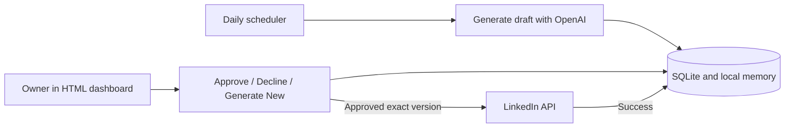

# Architecture

The UI is a standalone HTML/CSS/JavaScript frontend in `frontend/`. JavaScript calls
Python JSON endpoints using same-origin session cookies and CSRF headers. There is
no frontend build step or browser-side API key. Flask serves the static files by
default. You can serve them through a separate web server on the same origin and
proxy `/api/*` to Python. Opening files with `file://` does not provide the backend.

| File | Responsibility |
| --- | --- |
| `dashboard.py` | Session login, CSRF, JSON endpoints and approval actions |
| `frontend/` | Static login/review pages, CSS, API client and rendering |
| `scheduler.py` | SQLite schema, generation, repetition checks, publication, daily loop |
| `linkedin_auth.py` | Refresh-token exchange and atomic token cache |
| `scripts/setup.py` | Non-destructive first-run setup and legacy profile migration |

One scheduler and one dashboard share `data/`. A process lock serializes mutations.
The default Gunicorn deployment has one worker and four threads. Calls are synchronous;
a long generation can make another action report that the app is busy. This is a
small single-owner deployment, not a distributed queue.

Drafts progress from `draft` to `approved` to `sending` to `published`. Declining
changes status to `declined`. Regeneration increments the version and returns to
`draft`. Old versions cannot approve replacements. A definite client rejection can
return a post to draft; an uncertain network outcome leaves it in `sending` until
the owner checks LinkedIn and resolves it. Memory advances only after success.

The daily loop runs at 20:00 in `TIMEZONE`, with same-evening catch-up. Pending drafts
carry over instead of accumulating. There is no unattended publishing path.

## Frontend API

GET `/api/session` returns `{authenticated, csrf}` and initializes the browser
session. Every POST sends `X-CSRF-Token` and URL-encoded form fields. A successful
login rotates the CSRF token. Authenticated calls use same-origin cookies; the app
does not enable cross-origin credential access.

| Method | Path | Purpose |
| --- | --- | --- |
| GET | `/api/session` | Session state and CSRF token |
| POST | `/api/login` | `username` and `password`; returns session state |
| POST | `/api/logout` | Clear session |
| GET | `/api/dashboard` | Private posts, summary, previous post and display settings |
| POST | `/api/draft` | Prepare a draft |
| POST | `/api/posts/<day>/approve` | Publish exact `revision` after approval |
| POST | `/api/posts/<day>/decline` | Decline exact `revision` |
| POST | `/api/posts/<day>/regenerate` | Replace exact `revision` |
| POST | `/api/notes` | Optional legacy note input using `body` |
| GET | `/healthz` | Liveness, no private data |

Errors return JSON `{error}` with an HTTP error status. The frontend uses
`textContent` for generated content, disables action buttons during mutations, and
does not automatically retry writes. The public HTML shell contains no private data.
Deploy `/`, `/login`, `/static/*` and `/api/*` on the same origin; if using a separate
static server, map `/login` to `frontend/login.html` and `/` to `frontend/index.html`.
